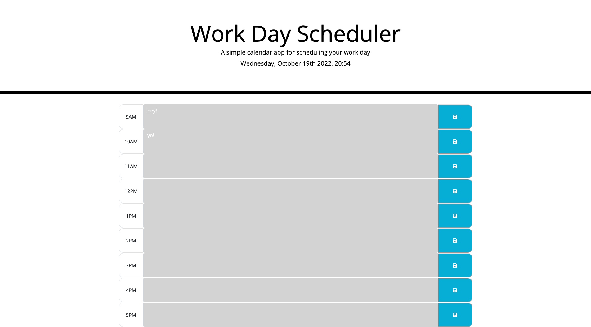

# steves-work-day-scheduler

## Description

This scheduler will update its time and colors automatically, and can save the user's inputs to local storage, which are still displayed when the page is reloaded.

## Usage

Deployed website: [https://sgsetts.github.io/steves-work-day-scheduler/](https://sgsetts.github.io/steves-work-day-scheduler/)

## License

MIT License